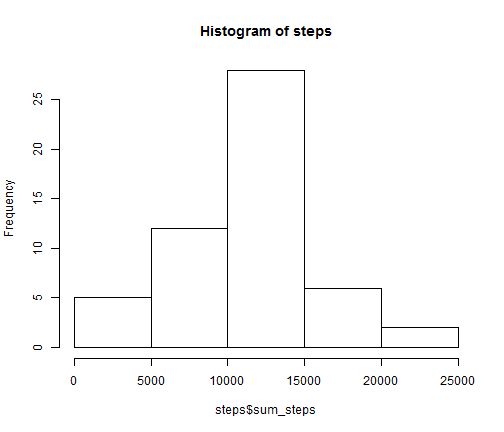
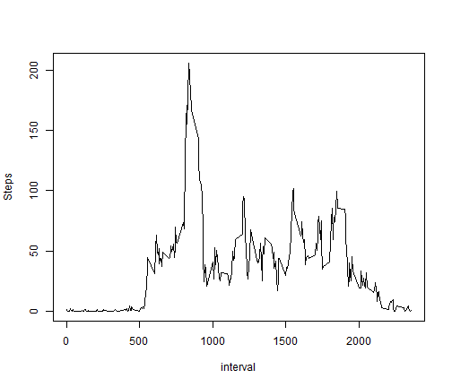
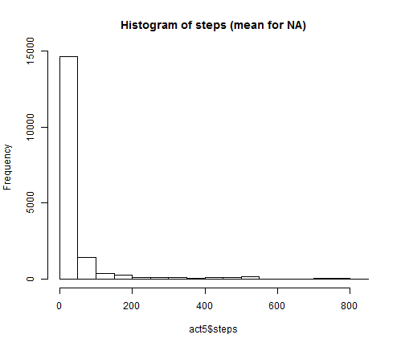
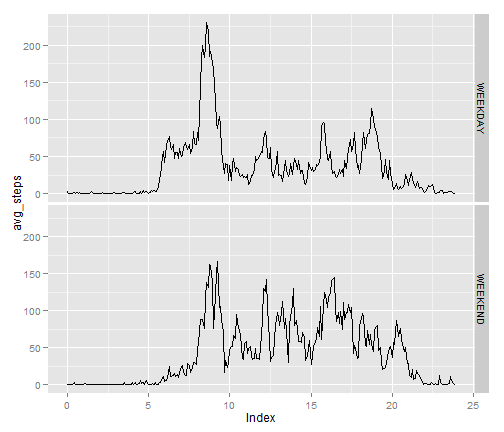

PA1: reproducible research
========================================================

```r
## reproducible research assignment one 
# housekeeping

library(plyr)
library(sqldf)
```

```
## Loading required package: gsubfn
## Loading required package: proto
## Loading required package: RSQLite
## Loading required package: DBI
## Loading required package: RSQLite.extfuns
```

```r
library(lubridate)
```

```
## Warning: package 'lubridate' was built under R version 3.1.2
```

```
## 
## Attaching package: 'lubridate'
## 
## The following object is masked from 'package:plyr':
## 
##     here
```

```r
library(scales)
```

```
## Warning: package 'scales' was built under R version 3.1.1
```

```r
library(ggplot2)
```

```
## Warning: package 'ggplot2' was built under R version 3.1.1
```

```r
library(chron)
```

```
## 
## Attaching package: 'chron'
## 
## The following objects are masked from 'package:lubridate':
## 
##     days, hours, minutes, seconds, years
```

```r
activity <- read.csv("activity.csv", header=TRUE, sep=",", quote= "\"")
# make "date" a date
activity[[2]] <- as.Date(activity[[2]])
activity$interval <- formatC(activity$interval,width=4, format="d", flag="0")

# ignore NAs
complete <- na.omit(activity)

## What is the mean total number of steps taken per day?
# sql w/ group by on date for steps
steps <- sqldf("select date, sum(steps) from complete group by date")
```

```
## Loading required package: tcltk
```

```r
colnames(steps) <- c("date","sum_steps")
```

```r
# histogram
hist(steps$sum_steps, main="Histogram of steps")
```

 

```r
# mean & median total nbr of steps each day
aggregate(activity[,1], list(activity$date), mean, na.action=na.omit)
```

```
##       Group.1       x
## 1  2012-10-01      NA
## 2  2012-10-02  0.4375
## 3  2012-10-03 39.4167
## 4  2012-10-04 42.0694
## 5  2012-10-05 46.1597
## 6  2012-10-06 53.5417
## 7  2012-10-07 38.2465
## 8  2012-10-08      NA
## 9  2012-10-09 44.4826
## 10 2012-10-10 34.3750
## 11 2012-10-11 35.7778
## 12 2012-10-12 60.3542
## 13 2012-10-13 43.1458
## 14 2012-10-14 52.4236
## 15 2012-10-15 35.2049
## 16 2012-10-16 52.3750
## 17 2012-10-17 46.7083
## 18 2012-10-18 34.9167
## 19 2012-10-19 41.0729
## 20 2012-10-20 36.0938
## 21 2012-10-21 30.6285
## 22 2012-10-22 46.7361
## 23 2012-10-23 30.9653
## 24 2012-10-24 29.0104
## 25 2012-10-25  8.6528
## 26 2012-10-26 23.5347
## 27 2012-10-27 35.1354
## 28 2012-10-28 39.7847
## 29 2012-10-29 17.4236
## 30 2012-10-30 34.0938
## 31 2012-10-31 53.5208
## 32 2012-11-01      NA
## 33 2012-11-02 36.8056
## 34 2012-11-03 36.7049
## 35 2012-11-04      NA
## 36 2012-11-05 36.2465
## 37 2012-11-06 28.9375
## 38 2012-11-07 44.7326
## 39 2012-11-08 11.1771
## 40 2012-11-09      NA
## 41 2012-11-10      NA
## 42 2012-11-11 43.7778
## 43 2012-11-12 37.3785
## 44 2012-11-13 25.4722
## 45 2012-11-14      NA
## 46 2012-11-15  0.1424
## 47 2012-11-16 18.8924
## 48 2012-11-17 49.7882
## 49 2012-11-18 52.4653
## 50 2012-11-19 30.6979
## 51 2012-11-20 15.5278
## 52 2012-11-21 44.3993
## 53 2012-11-22 70.9271
## 54 2012-11-23 73.5903
## 55 2012-11-24 50.2708
## 56 2012-11-25 41.0903
## 57 2012-11-26 38.7569
## 58 2012-11-27 47.3819
## 59 2012-11-28 35.3576
## 60 2012-11-29 24.4688
## 61 2012-11-30      NA
```

```r
aggregate(activity[,1], list(activity$date), median, na.rm=TRUE)
```

```
##       Group.1  x
## 1  2012-10-01 NA
## 2  2012-10-02  0
## 3  2012-10-03  0
## 4  2012-10-04  0
## 5  2012-10-05  0
## 6  2012-10-06  0
## 7  2012-10-07  0
## 8  2012-10-08 NA
## 9  2012-10-09  0
## 10 2012-10-10  0
## 11 2012-10-11  0
## 12 2012-10-12  0
## 13 2012-10-13  0
## 14 2012-10-14  0
## 15 2012-10-15  0
## 16 2012-10-16  0
## 17 2012-10-17  0
## 18 2012-10-18  0
## 19 2012-10-19  0
## 20 2012-10-20  0
## 21 2012-10-21  0
## 22 2012-10-22  0
## 23 2012-10-23  0
## 24 2012-10-24  0
## 25 2012-10-25  0
## 26 2012-10-26  0
## 27 2012-10-27  0
## 28 2012-10-28  0
## 29 2012-10-29  0
## 30 2012-10-30  0
## 31 2012-10-31  0
## 32 2012-11-01 NA
## 33 2012-11-02  0
## 34 2012-11-03  0
## 35 2012-11-04 NA
## 36 2012-11-05  0
## 37 2012-11-06  0
## 38 2012-11-07  0
## 39 2012-11-08  0
## 40 2012-11-09 NA
## 41 2012-11-10 NA
## 42 2012-11-11  0
## 43 2012-11-12  0
## 44 2012-11-13  0
## 45 2012-11-14 NA
## 46 2012-11-15  0
## 47 2012-11-16  0
## 48 2012-11-17  0
## 49 2012-11-18  0
## 50 2012-11-19  0
## 51 2012-11-20  0
## 52 2012-11-21  0
## 53 2012-11-22  0
## 54 2012-11-23  0
## 55 2012-11-24  0
## 56 2012-11-25  0
## 57 2012-11-26  0
## 58 2012-11-27  0
## 59 2012-11-28  0
## 60 2012-11-29  0
## 61 2012-11-30 NA
```

```r
## What is the average daily activity pattern?
# combine activity with date time
time1 <- as.POSIXlt(paste(activity$date, activity$interval), "%Y-%m-%d %H%M", tz="")

# create time series
act3 <- aggregate(activity[,1], list(activity$interval),mean, na.rm=TRUE)
```

```r
# plot it
with(act3, plot(Group.1,x, type="l", ylab = "Steps", xlab ="interval"))
```

 

```r
# maximum number of steps across 5m intervals
# sort in descending on average
act3[order(-act3$x),]
```

```
##     Group.1         x
## 104    0835 206.16981
## 105    0840 195.92453
## 107    0850 183.39623
## 106    0845 179.56604
## 103    0830 177.30189
## 101    0820 171.15094
## 108    0855 167.01887
## 100    0815 157.52830
## 102    0825 155.39623
## 109    0900 143.45283
## 99     0810 129.43396
## 110    0905 124.03774
## 111    0910 109.11321
## 112    0915 108.11321
## 113    0920 103.71698
## 191    1550 102.11321
## 226    1845  99.45283
## 190    1545  98.66038
## 114    0925  95.96226
## 147    1210  94.84906
## 148    1215  92.77358
## 146    1205  87.69811
## 227    1850  86.58491
## 228    1855  85.60377
## 225    1840  85.33962
## 220    1815  85.32075
## 229    1900  84.86792
## 192    1555  83.96226
## 189    1540  82.90566
## 210    1725  78.94340
## 230    1905  77.83019
## 223    1830  77.69811
## 213    1740  75.09434
## 219    1810  74.69811
## 195    1610  74.54717
## 224    1835  74.24528
## 97     0800  73.37736
## 209    1720  72.71698
## 94     0745  69.54717
## 211    1730  68.94340
## 98     0805  68.20755
## 222    1825  67.77358
## 156    1255  67.28302
## 115    0930  66.20755
## 188    1535  65.32075
## 194    1605  64.13208
## 145    1200  63.86792
## 76     0615  63.45283
## 149    1220  63.39623
## 196    1615  63.16981
## 193    1600  62.13208
## 208    1715  61.22642
## 168    1355  60.81132
## 198    1625  59.77358
## 212    1735  59.66038
## 221    1820  59.26415
## 144    1155  59.18868
## 231    1910  58.03774
## 218    1805  58.01887
## 95     0750  57.84906
## 197    1620  56.90566
## 214    1745  56.50943
## 162    1325  56.43396
## 206    1705  56.30189
## 96     0755  56.15094
## 169    1400  55.75472
## 91     0730  55.67925
## 88     0715  54.50943
## 151    1230  54.47170
## 75     0610  53.77358
## 166    1345  53.54717
## 232    1915  53.35849
## 124    1015  52.66038
## 93     0740  52.26415
## 79     0630  52.15094
## 170    1405  51.96226
## 90     0725  50.98113
## 126    1025  50.79245
## 207    1710  50.71698
## 87     0710  50.50943
## 150    1225  50.16981
## 140    1135  49.98113
## 77     0620  49.96226
## 89     0720  49.92453
## 74     0605  49.26415
## 84     0655  49.03774
## 172    1415  48.69811
## 187    1530  48.13208
## 186    1525  47.75472
## 167    1350  47.32075
## 78     0625  47.07547
## 205    1700  46.62264
## 161    1320  46.24528
## 203    1650  46.20755
## 143    1150  46.03774
## 185    1520  45.96226
## 239    1950  45.66038
## 202    1645  45.45283
## 116    0935  45.22642
## 155    1250  45.05660
## 201    1640  44.66038
## 142    1145  44.60377
## 72     0555  44.49057
## 86     0705  44.37736
## 92     0735  44.32075
## 127    1030  44.28302
## 82     0645  44.16981
## 81     0640  44.01887
## 199    1630  43.86792
## 85     0700  43.81132
## 180    1455  43.77358
## 204    1655  43.67925
## 179    1450  43.62264
## 171    1410  43.58491
## 159    1310  43.26415
## 163    1330  42.75472
## 123    1010  42.41509
## 157    1300  42.33962
## 141    1140  42.03774
## 175    1430  41.84906
## 160    1315  40.98113
## 217    1800  40.67925
## 121    1000  40.56604
## 236    1935  40.01887
## 165    1340  39.96226
## 158    1305  39.88679
## 71     0550  39.45283
## 80     0635  39.33962
## 125    1020  38.92453
## 184    1515  38.84906
## 118    0945  38.75472
## 200    1635  38.56604
## 154    1245  37.73585
## 174    1425  37.54717
## 216    1755  37.45283
## 128    1035  37.41509
## 83     0650  37.35849
## 233    1920  36.32075
## 182    1505  36.07547
## 183    1510  35.49057
## 173    1420  35.47170
## 119    0950  34.98113
## 215    1750  34.77358
## 129    1040  34.69811
## 240    1955  33.52830
## 139    1130  33.43396
## 244    2015  33.33962
## 152    1235  32.41509
## 251    2050  32.30189
## 132    1055  31.94340
## 73     0600  31.49057
## 133    1100  31.35849
## 237    1940  30.20755
## 181    1500  30.01887
## 134    1105  29.67925
## 137    1120  28.37736
## 130    1045  28.33962
## 176    1435  27.50943
## 235    1930  27.39623
## 247    2030  27.30189
## 122    1005  26.98113
## 245    2020  26.81132
## 153    1240  26.52830
## 138    1125  26.47170
## 178    1445  26.07547
## 136    1115  25.54717
## 238    1945  25.54717
## 164    1335  25.13208
## 131    1050  25.09434
## 117    0940  24.79245
## 255    2110  23.45283
## 248    2035  21.33962
## 135    1110  21.32075
## 250    2045  21.32075
## 246    2025  21.16981
## 120    0955  21.05660
## 234    1925  20.71698
## 252    2055  20.15094
## 241    2000  19.62264
## 249    2040  19.54717
## 243    2010  19.33962
## 256    2115  19.24528
## 242    2005  19.01887
## 70     0545  18.33962
## 254    2105  17.22642
## 177    1440  17.11321
## 260    2135  16.30189
## 69     0540  16.01887
## 253    2100  15.94340
## 259    2130  14.66038
## 257    2120  12.45283
## 271    2230   9.75472
## 270    2225   8.69811
## 261    2140   8.67925
## 268    2215   8.50943
## 263    2150   8.13208
## 258    2125   8.01887
## 262    2145   7.79245
## 269    2220   7.07547
## 68     0535   6.05660
## 267    2210   4.81132
## 284    2335   4.69811
## 276    2255   4.60377
## 55     0430   4.11321
## 266    2205   3.67925
## 57     0440   3.49057
## 65     0520   3.32075
## 277    2300   3.30189
## 285    2340   3.30189
## 59     0450   3.11321
## 63     0510   3.00000
## 66     0525   2.96226
## 278    2305   2.84906
## 264    2155   2.62264
## 283    2330   2.60377
## 51     0410   2.56604
## 64     0515   2.24528
## 272    2235   2.20755
## 6      0025   2.09434
## 67     0530   2.09434
## 19     0130   1.83019
## 1      0000   1.71698
## 43     0330   1.62264
## 275    2250   1.60377
## 282    2325   1.58491
## 62     0505   1.56604
## 35     0250   1.54717
## 10     0045   1.47170
## 265    2200   1.45283
## 49     0400   1.18868
## 27     0210   1.13208
## 18     0125   1.11321
## 60     0455   1.11321
## 288    2355   1.07547
## 281    2320   0.96226
## 36     0255   0.94340
## 50     0405   0.94340
## 8      0035   0.86792
## 58     0445   0.83019
## 280    2315   0.83019
## 14     0105   0.67925
## 56     0435   0.66038
## 286    2345   0.64151
## 42     0325   0.62264
## 44     0335   0.58491
## 7      0030   0.52830
## 45     0340   0.49057
## 22     0145   0.37736
## 54     0425   0.35849
## 2      0005   0.33962
## 16     0115   0.33962
## 53     0420   0.33962
## 13     0100   0.32075
## 273    2240   0.32075
## 11     0050   0.30189
## 23     0150   0.26415
## 32     0235   0.22642
## 287    2350   0.22642
## 41     0320   0.20755
## 20     0135   0.16981
## 21     0140   0.16981
## 4      0015   0.15094
## 15     0110   0.15094
## 3      0010   0.13208
## 12     0055   0.13208
## 30     0225   0.13208
## 274    2245   0.11321
## 5      0020   0.07547
## 46     0345   0.07547
## 9      0040   0.00000
## 17     0120   0.00000
## 24     0155   0.00000
## 25     0200   0.00000
## 26     0205   0.00000
## 28     0215   0.00000
## 29     0220   0.00000
## 31     0230   0.00000
## 33     0240   0.00000
## 34     0245   0.00000
## 37     0300   0.00000
## 38     0305   0.00000
## 39     0310   0.00000
## 40     0315   0.00000
## 47     0350   0.00000
## 48     0355   0.00000
## 52     0415   0.00000
## 61     0500   0.00000
## 279    2310   0.00000
```

```r
## Impute missing values
# calc and report total number of rows with missing values
sapply(activity, function(x) sum(is.na(x)))
```

```
##    steps     date interval 
##     2304        0        0
```

```r
# fill in the missing values with plyr replace missing values with the calculated mean
impute.mean <- function(x) replace(x, is.na(x), mean(x, na.rm = TRUE))
act4 <- ddply(activity, ~ interval, transform, steps = impute.mean(steps))
act5 <- act4[order(act4$date,act4$interval),]
```

```r
# histogram of steps
hist(act5$steps, main="Histogram of steps (mean for NA)")
```

 

```r
# mean and median per day
aggregate(act5[,1], list(act5$date), mean, na.action=na.omit)
```

```
##       Group.1       x
## 1  2012-10-01 37.3826
## 2  2012-10-02  0.4375
## 3  2012-10-03 39.4167
## 4  2012-10-04 42.0694
## 5  2012-10-05 46.1597
## 6  2012-10-06 53.5417
## 7  2012-10-07 38.2465
## 8  2012-10-08 37.3826
## 9  2012-10-09 44.4826
## 10 2012-10-10 34.3750
## 11 2012-10-11 35.7778
## 12 2012-10-12 60.3542
## 13 2012-10-13 43.1458
## 14 2012-10-14 52.4236
## 15 2012-10-15 35.2049
## 16 2012-10-16 52.3750
## 17 2012-10-17 46.7083
## 18 2012-10-18 34.9167
## 19 2012-10-19 41.0729
## 20 2012-10-20 36.0938
## 21 2012-10-21 30.6285
## 22 2012-10-22 46.7361
## 23 2012-10-23 30.9653
## 24 2012-10-24 29.0104
## 25 2012-10-25  8.6528
## 26 2012-10-26 23.5347
## 27 2012-10-27 35.1354
## 28 2012-10-28 39.7847
## 29 2012-10-29 17.4236
## 30 2012-10-30 34.0938
## 31 2012-10-31 53.5208
## 32 2012-11-01 37.3826
## 33 2012-11-02 36.8056
## 34 2012-11-03 36.7049
## 35 2012-11-04 37.3826
## 36 2012-11-05 36.2465
## 37 2012-11-06 28.9375
## 38 2012-11-07 44.7326
## 39 2012-11-08 11.1771
## 40 2012-11-09 37.3826
## 41 2012-11-10 37.3826
## 42 2012-11-11 43.7778
## 43 2012-11-12 37.3785
## 44 2012-11-13 25.4722
## 45 2012-11-14 37.3826
## 46 2012-11-15  0.1424
## 47 2012-11-16 18.8924
## 48 2012-11-17 49.7882
## 49 2012-11-18 52.4653
## 50 2012-11-19 30.6979
## 51 2012-11-20 15.5278
## 52 2012-11-21 44.3993
## 53 2012-11-22 70.9271
## 54 2012-11-23 73.5903
## 55 2012-11-24 50.2708
## 56 2012-11-25 41.0903
## 57 2012-11-26 38.7569
## 58 2012-11-27 47.3819
## 59 2012-11-28 35.3576
## 60 2012-11-29 24.4688
## 61 2012-11-30 37.3826
```

```r
aggregate(act5[,1], list(act5$date), median)
```

```
##       Group.1     x
## 1  2012-10-01 34.11
## 2  2012-10-02  0.00
## 3  2012-10-03  0.00
## 4  2012-10-04  0.00
## 5  2012-10-05  0.00
## 6  2012-10-06  0.00
## 7  2012-10-07  0.00
## 8  2012-10-08 34.11
## 9  2012-10-09  0.00
## 10 2012-10-10  0.00
## 11 2012-10-11  0.00
## 12 2012-10-12  0.00
## 13 2012-10-13  0.00
## 14 2012-10-14  0.00
## 15 2012-10-15  0.00
## 16 2012-10-16  0.00
## 17 2012-10-17  0.00
## 18 2012-10-18  0.00
## 19 2012-10-19  0.00
## 20 2012-10-20  0.00
## 21 2012-10-21  0.00
## 22 2012-10-22  0.00
## 23 2012-10-23  0.00
## 24 2012-10-24  0.00
## 25 2012-10-25  0.00
## 26 2012-10-26  0.00
## 27 2012-10-27  0.00
## 28 2012-10-28  0.00
## 29 2012-10-29  0.00
## 30 2012-10-30  0.00
## 31 2012-10-31  0.00
## 32 2012-11-01 34.11
## 33 2012-11-02  0.00
## 34 2012-11-03  0.00
## 35 2012-11-04 34.11
## 36 2012-11-05  0.00
## 37 2012-11-06  0.00
## 38 2012-11-07  0.00
## 39 2012-11-08  0.00
## 40 2012-11-09 34.11
## 41 2012-11-10 34.11
## 42 2012-11-11  0.00
## 43 2012-11-12  0.00
## 44 2012-11-13  0.00
## 45 2012-11-14 34.11
## 46 2012-11-15  0.00
## 47 2012-11-16  0.00
## 48 2012-11-17  0.00
## 49 2012-11-18  0.00
## 50 2012-11-19  0.00
## 51 2012-11-20  0.00
## 52 2012-11-21  0.00
## 53 2012-11-22  0.00
## 54 2012-11-23  0.00
## 55 2012-11-24  0.00
## 56 2012-11-25  0.00
## 57 2012-11-26  0.00
## 58 2012-11-27  0.00
## 59 2012-11-28  0.00
## 60 2012-11-29  0.00
## 61 2012-11-30 34.11
```

```r
#do the values differ?  yes
# what is the impact of imputing the data? no longer a normal distribution

## Are there differences in activity patterns between weekdays and weekends?

act4$daytype <- ifelse(weekdays(act4$date) %in% c('Saturday','Sunday'), "WEEKEND", "WEEKDAY")
#
##calcl mean for weekday and weekend
act5 <- aggregate(act4[,1], by=list(act4$interval, act4$daytype),mean, na.rm=TRUE)
colnames(act5) <- c("interval","day_type", "avg_steps")
act5$interval <-as.POSIXlt(act5$interval,"%H%M", tz="")
act5$interval <- times(format(act5$interval, "%H:%M:%S"))
act5$interval <- as.character(act5$interval)
act5$Index <- sapply(strsplit(act5$interval,":"),
function(x) {
x <- as.numeric(x)
x[1]+x[2]/60
}
)
```

```r
# plot it

sp <- ggplot(act5, aes(x=Index, y=avg_steps)) + geom_line(linetype="solid")
sp + facet_grid(day_type ~ .)
```

 

```r
dev.off()
```

```
## null device 
##           1
```
